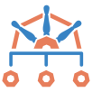

# 👋 Hey there — Welcome!

I’m a **DevOps Engineer** with **3+ years** of hands-on experience building, automating, and scaling infrastructure across **all major cloud platforms**.

---

### 🛠️ Certifications I've Earned:
-  **Kubernetes**
    - ✅ **CKA** – Certified Kubernetes Administrator  
    - ✅ **CKS** – Certified Kubernetes Security Specialist  
    - ✅ **KCNA** – Kubernetes and Cloud Native Associate  
-  **Azure**
    - ✅ **AZ-400** – DevOps Engineer Expert   
    - ✅ **AZ-104** – Azure Administrator Associate  
    - ✅ **AZ-900** – Azure Fundamentals  
-  **Kyverno Certified Associate**  
-  **Terraform Associate (003)**

---

### ✍️ What You'll Find Here:
This site is where I share **technical blogs** on topics I’m actively learning, exploring, or using in production.  

<strong>Expect content on:<strong> 
<!-- we can make the above as heading by putting **** -->

- 🔧 Kubernetes
- ☁️ Cloud Infrastructure
- 🔐 DevSecOps
- 📦 CI/CD
- 📜 Infrastructure as Code
- 🛡️ Cloud Security & Governance

---

*Thanks for stopping by — hope you find something useful here!*

— **JustACloudNerd**
